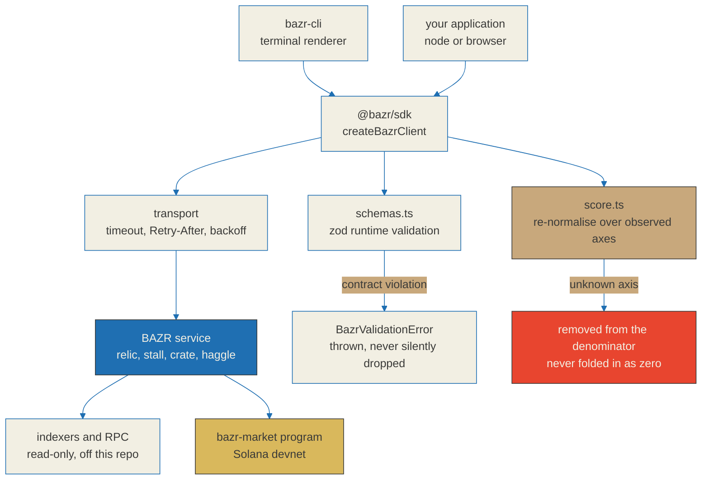

# BAZR SDK and CLI

<p align="center">
<a href="https://bazr.market"></a>
<a href="https://api.bazr.market/health"></a>
<a href="https://github.com/BazrMarket/bazr"></a>
<a href="https://github.com/BazrMarket/bazr-sdk/actions/workflows/ci.yml"></a>
<a href="https://github.com/BazrMarket/bazr-sdk/blob/main/LICENSE"></a>
<a href="https://www.typescriptlang.org/"></a>
<a href="https://nodejs.org/en/download"></a>
<a href="https://zod.dev"></a>
<a href="https://vitest.dev"></a>
<a href="https://explorer.solana.com/address/FSLSR2xYiR5NPWg6g8DZ1KyVRVa7xW37gDStbaDfSXLb?cluster=devnet"></a>
<a href="https://github.com/BazrMarket/bazr-sdk#status-nothing-here-is-published-to-npm-yet"></a>
<a href="https://github.com/BazrMarket/bazr/blob/main/docs/relic-spec.md"></a>
</p>

Two TypeScript packages for reading the BAZR relic API: a typed client library
and a terminal client built on top of it.

BAZR is an aftermarket for Solana meme tokens that **already graduated from a
launchpad**. It scores what survived, publishes the formula, and shows the
reasoning behind every number.

**A relic score is a summary of survival signals, not a prediction of price or
revival.** It compresses what could be observed about a token after graduation
into one number and five axes, each of which is shown with its own weight and
its own contribution. There is no trending feed, no new-launch feed, no ranking
of what is about to move, and no sniping surface. Those are deliberate absences,
not gaps waiting to be filled.

---

## What is in this repository

| Package | Name | What it does |
| --- | --- | --- |
| `packages/sdk-ts` | `@bazr/sdk` | Typed client for the relic API. Runtime-validated responses, retry and backoff policy, score re-normalisation maths. |
| `packages/cli` | `bazr-cli` | Terminal client. Renders relic tags, axis breakdowns, stall records, crates and route quotes. Depends on `@bazr/sdk`. |

The Anchor program, the relic specification, the API contract and the sourcing
research live in the main repository, [BazrMarket/bazr](https://github.com/BazrMarket/bazr).
The hosted web frontend and the indexing service are not open source and are not
in either repository.

---

## Status: nothing here is published to npm yet

**Neither `@bazr/sdk` nor `bazr-cli` has been published to the npm registry.**
`npm install @bazr/sdk` and `npm install -g bazr-cli` do not work today and will
fail with `E404`. Both manifests carry `publishConfig.access: public` and are
ready for a release, but the release has not happened.

Until it does, the only supported installation is a build from source, described
in the next section. That build is not a workaround shown for completeness -- it
is the real and only path, and every command in it was executed against this
tree before it was written down.

When the packages are published, the order is fixed: `@bazr/sdk` first, then
`bazr-cli`. The CLI depends on the SDK by registry range (`^0.1.0`), so
publishing the CLI first would upload a package nobody can install, and the
`E404` names the SDK rather than the CLI.

---

## Architecture



---

## Install from source

Node 18 or newer. Lockfiles are committed for both packages, so the dependency
tree is reproducible.

```bash
git clone https://github.com/BazrMarket/bazr-sdk.git
cd bazr-sdk

cd packages/sdk-ts
npm install
npm run build
npm test

cd ../cli
npm install
npm run build
npm test
```

`packages/cli` resolves `@bazr/sdk` from its committed lockfile as a link to
`../sdk-ts`, so the sibling package is picked up without any extra linking step
and without a registry. The CLI test suite rebuilds both bundles before it runs,
because a spawned-process test against a stale `dist/` measures the wrong thing.

Run the built binary directly, or put `bazr` on your `PATH` with `npm link`:

```bash
node packages/cli/dist/bazr.js --help
node packages/cli/dist/bazr.js health --api https://api.bazr.market

cd packages/cli && npm link    # optional; makes the `bazr` command available
```

That second command answers from the deployed service today:

```
PASS  https://api.bazr.market
      status ok, version 0.1.0
```

---

## Quick start -- SDK

```ts
import { createBazrClient, axisRows, normalizedScore } from "@bazr/sdk";

const bazr = createBazrClient({
  baseUrl: "https://api.bazr.market",
});

const relic = await bazr.getRelic("So11111111111111111111111111111111111111112");

console.log(relic.score, relic.verdict);   // 71 "dormant"
console.log(relic.disclaimer);             // always present in the response

for (const row of axisRows(relic.axes)) {
  // An axis that was not observed comes back with score null.
  // Print "--", never 0. They are different events.
  console.log(row.label, row.score ?? "--", row.contribution ?? "no data");
}

const n = normalizedScore(relic.axes);
console.log(n.observed.length, "of 5 axes observed");
console.log((n.weightCoverage * 100).toFixed(0) + "% of the weight was observable");
```

Every failure throws a typed error rather than resolving to an empty object:
`BazrApiError`, `BazrRateLimitError` (carrying `retryAfterMs`),
`BazrNetworkError`, `BazrTimeoutError`, `BazrValidationError` (carrying the zod
issues) and `BazrConfigError`. Full reference in
[`packages/sdk-ts/README.md`](packages/sdk-ts/README.md).

---

