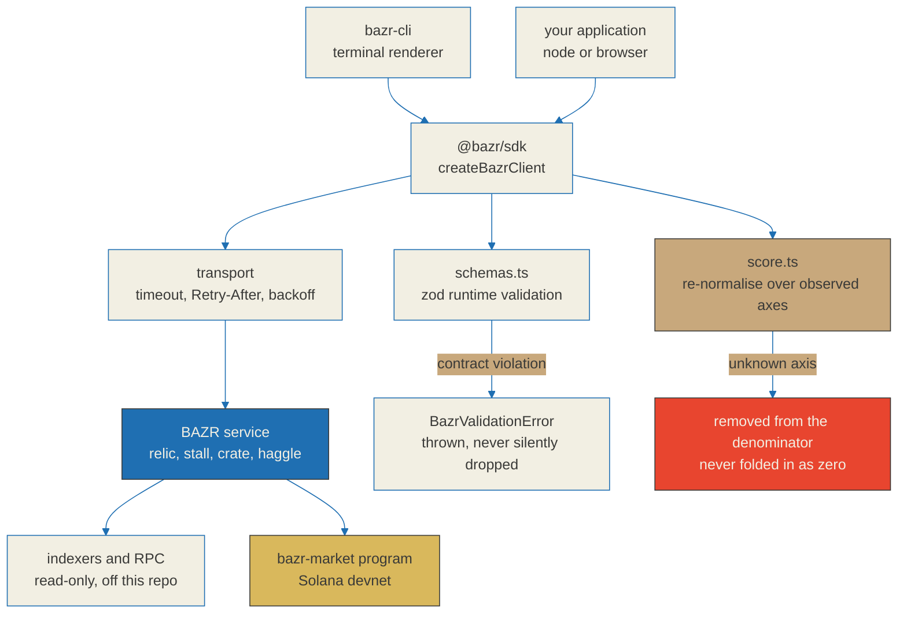

# BAZR SDK and CLI

<p align="center">
<a href="https://bazr.market"></a>
<a href="https://api.bazr.market/health"></a>
<a href="https://github.com/BazrMarket/bazr"></a>
<a href="https://github.com/BazrMarket/bazr-sdk/actions/workflows/ci.yml"></a>
<a href="https://github.com/BazrMarket/bazr-sdk/blob/main/LICENSE"></a>
<a href="https://www.typescriptlang.org/"></a>
<a href="https://nodejs.org/en/download"></a>
<a href="https://zod.dev"></a>
<a href="https://vitest.dev"></a>
<a href="https://explorer.solana.com/address/FSLSR2xYiR5NPWg6g8DZ1KyVRVa7xW37gDStbaDfSXLb?cluster=devnet"></a>
<a href="https://github.com/BazrMarket/bazr-sdk#status-nothing-here-is-published-to-npm-yet"></a>
<a href="https://github.com/BazrMarket/bazr/blob/main/docs/relic-spec.md"></a>
</p>

Two TypeScript packages for reading the BAZR relic API: a typed client library
and a terminal client built on top of it.

BAZR is an aftermarket for Solana meme tokens that **already graduated from a
launchpad**. It scores what survived, publishes the formula, and shows the
reasoning behind every number.

**A relic score is a summary of survival signals, not a prediction of price or
revival.** It compresses what could be observed about a token after graduation
into one number and five axes, each of which is shown with its own weight and
its own contribution. There is no trending feed, no new-launch feed, no ranking
of what is about to move, and no sniping surface. Those are deliberate absences,
not gaps waiting to be filled.

---

## What is in this repository

| Package | Name | What it does |
| --- | --- | --- |
| `packages/sdk-ts` | `@bazr/sdk` | Typed client for the relic API. Runtime-validated responses, retry and backoff policy, score re-normalisation maths. |
| `packages/cli` | `bazr-cli` | Terminal client. Renders relic tags, axis breakdowns, stall records, crates and route quotes. Depends on `@bazr/sdk`. |

The Anchor program, the relic specification, the API contract and the sourcing
research live in the main repository, [BazrMarket/bazr](https://github.com/BazrMarket/bazr).
The hosted web frontend and the indexing service are not open source and are not
in either repository.

---

## Status: nothing here is published to npm yet

**Neither `@bazr/sdk` nor `bazr-cli` has been published to the npm registry.**
`npm install @bazr/sdk` and `npm install -g bazr-cli` do not work today and will
fail with `E404`. Both manifests carry `publishConfig.access: public` and are
ready for a release, but the release has not happened.

Until it does, the only supported installation is a build from source, described
in the next section. That build is not a workaround shown for completeness -- it
is the real and only path, and every command in it was executed against this
tree before it was written down.

When the packages are published, the order is fixed: `@bazr/sdk` first, then
`bazr-cli`. The CLI depends on the SDK by registry range (`^0.1.0`), so
publishing the CLI first would upload a package nobody can install, and the
`E404` names the SDK rather than the CLI.

---

## Architecture



---

## Install from source

Node 18 or newer. Lockfiles are committed for both packages, so the dependency
tree is reproducible.

```bash
git clone https://github.com/BazrMarket/bazr-sdk.git
cd bazr-sdk

cd packages/sdk-ts
npm install
npm run build
npm test

cd ../cli
npm install
npm run build
npm test
```

`packages/cli` resolves `@bazr/sdk` from its committed lockfile as a link to
`../sdk-ts`, so the sibling package is picked up without any extra linking step
and without a registry. The CLI test suite rebuilds both bundles before it runs,
because a spawned-process test against a stale `dist/` measures the wrong thing.

Run the built binary directly, or put `bazr` on your `PATH` with `npm link`:

```bash
node packages/cli/dist/bazr.js --help
node packages/cli/dist/bazr.js health --api https://api.bazr.market

cd packages/cli && npm link    # optional; makes the `bazr` command available
```

That second command answers from the deployed service today:

```
PASS  https://api.bazr.market
      status ok, version 0.1.0
```

---

## Quick start -- SDK

```ts
import { createBazrClient, axisRows, normalizedScore } from "@bazr/sdk";

const bazr = createBazrClient({
  baseUrl: "https://api.bazr.market",
});

const relic = await bazr.getRelic("So11111111111111111111111111111111111111112");

console.log(relic.score, relic.verdict);   // 71 "dormant"
console.log(relic.disclaimer);             // always present in the response

for (const row of axisRows(relic.axes)) {
  // An axis that was not observed comes back with score null.
  // Print "--", never 0. They are different events.
  console.log(row.label, row.score ?? "--", row.contribution ?? "no data");
}

const n = normalizedScore(relic.axes);
console.log(n.observed.length, "of 5 axes observed");
console.log((n.weightCoverage * 100).toFixed(0) + "% of the weight was observable");
```

Every failure throws a typed error rather than resolving to an empty object:
`BazrApiError`, `BazrRateLimitError` (carrying `retryAfterMs`),
`BazrNetworkError`, `BazrTimeoutError`, `BazrValidationError` (carrying the zod
issues) and `BazrConfigError`. Full reference in
[`packages/sdk-ts/README.md`](packages/sdk-ts/README.md).

---

## Quick start -- CLI

These assume `bazr` is on your `PATH` after `npm link`. Without it, substitute
`node packages/cli/dist/bazr.js` for `bazr`.

```bash
export BAZR_API=https://api.bazr.market

bazr health
bazr stats
bazr relic So11111111111111111111111111111111111111112
bazr stalls --sort record --limit 20
bazr crate show 3
bazr haggle --in <mint> --out <mint> --amount 1000000 --slippage-bps 100
bazr tags <mint> --json
```

Wrapped SOL against the deployed service, verbatim. Scoring a mint the service
has not cached walks holder pages and asks several upstreams first, so this run
was given more than the 90 second default:

```bash
bazr relic So11111111111111111111111111111111111111112 \
  --api https://api.bazr.market \
  --no-color --timeout 120000
```

```
+-[o]-- RELIC TAG ----------------------------------------------------------+
| SOL                                                                       |
| Wrapped SOL                                                               |
| So11111111111111111111111111111111111111112                               |
+---------------------------------------------------------------------------+
| SCORE       71 / 100  [#######...]                                        |
| VERDICT     dormant                                                       |
| OBSERVED    3 of 5 axes observed  (55% of the weight)                     |
| GRADUATED   2022-11-28                                                    |
| SCORED      2026-08-19 00:20:57Z  cache miss, age 0s                      |
+---------------------------------------------------------------------------+

AXIS BREAKDOWN
AXIS              SCORE  WEIGHT     SHARE  CONTRIB  METER
----------------  -----  ------  --------  -------  ------------
Holder spread        --     20%  excluded  no data  [no data   ]
Liquidity left       60     30%       55%     32.7  [######....]
Creator overhang    100     15%       27%     27.3  [##########]
Trading floor        --     25%  excluded  no data  [no data   ]
Afterglow            60     10%       18%     10.9  [######....]
      2 of 5 axes could not be observed. They are excluded from the weighting
      and re-normalised out, not counted as zero.
      Contributions sum to 70.9; the API reported 71.

TAGS
      none recorded

SOURCES  helius (getAccountInfo), helius (getTokenSupply), helius (getAsset),
         dexscreener (latest/dex/tokens), helius (getTokenAccounts)

NOTE  Survival-signal summary, not a prediction of price or revival.
```

Read what that output is admitting. Two of the five axes could not be observed,
so 45% of the weight is missing; the header says so, the rows say `no data`
rather than `0`, and the footer prints the contribution sum next to the score the
API reported so a mismatch would be visible instead of hidden. The score is a
weighted mean over the three axes that were actually observed.

`bazr stats` prints the counters the service actually holds. Missing values print
as `--` rather than as zero. `relics scored` is a live counter and moves whenever
a mint is scored, so the block below is a snapshot taken at
`2026-08-19T00:59:37Z`, not a fixed figure:

```
MARKET
      relics scored        8
      stalls open          1
      crates live          2
      aftermarket volume   --
      data cluster         mainnet
      program cluster      devnet
      anchor               0.31.1

      Counters the service actually holds. Missing values print as --.
```

Note the two separate cluster fields. The scoring pipeline reads mainnet token
data; the Anchor program is deployed to devnet. Collapsing those into one
`cluster` field would let "reads mainnet" be presented as "deployed on mainnet",
which is the exact false claim this project refuses to make.

---

## The relic score: five axes and their weights

The weights are fixed in [`docs/relic-spec.md`](https://github.com/BazrMarket/bazr/blob/main/docs/relic-spec.md)
section 7, which is the source of truth. They arrive on every axis in the API
response as `weight`, so the SDK never hard-codes a second copy that could drift.

| Axis | Weight | Why it carries that weight |
| --- | --- | --- |
| `lp_residual` | 0.30 | Exit liquidity is the first-order answer to "dead or dormant". Without it, a good reading on every other axis still means nobody can get out. |
| `floor_shape` | 0.25 | Direct evidence of continued trading. Most graduated tokens simply stop trading. |
| `holder_dispersion` | 0.20 | Structural risk. Extreme concentration lowers the quality of a dormant token even when liquidity remains. |
| `dev_wallet_state` | 0.15 | Residual control risk. Graduated tokens have often already revoked authorities, so this axis discriminates less than the two above. |
| `social_afterglow` | 0.10 | The weakest signal and the easiest to manufacture. Weighted lowest for that reason. |
| **Total** | **1.00** | |

Verdicts are `dormant`, `dead` or `unclear`. There is no `revival` verdict, no
probability of recovery, and no field anywhere in the contract that could be read
as one.

---

## Unknown axes leave the denominator

This is the single most important behaviour in the SDK, and it is why the score
maths lives in a file anyone can read
([`packages/sdk-ts/src/score.ts`](packages/sdk-ts/src/score.ts)).

When an axis cannot be observed, the API returns `status: "unknown"` and
`score: null`. `normalizedScore()` **removes that axis from the weighting
denominator and re-normalises the remaining weights over each other.** It is
never folded in as a zero.

```
available = { a in axes : a.status == "ok" and a.score is a number }
W_avail   = SUM of W_a over available
relic     = SUM (W_a * a.score) over available / W_avail
a.contribution = (W_a / W_avail) * a.score      for available axes
```

Folding an unobserved axis in as a zero would make a token whose data lookup
failed render identically to a token that was measured and found dead. Those are
different claims, and a number that collapses them into one is worse than no
number. If not one axis is observable, `score` is `null` -- never `0` -- and the
verdict is `unclear`.

The consequence is that a score always travels with a coverage figure. A score
computed over two of five axes is not the same object as a score computed over
five of five, even when the two numbers are equal, and every rendering surface in
this repository says which one you are looking at.

```ts
const n = normalizedScore(relic.axes);

n.score;           // weighted mean over observable axes only, or null
n.observed;        // ["lp_residual", "floor_shape", "holder_dispersion"]
n.unknown;         // ["dev_wallet_state", "social_afterglow"]
n.missing;         // canonical axes the payload did not contain at all
n.weightCoverage;  // 0.75 -- how much of the total weight was observable
n.contributions;   // per-axis contribution after re-normalisation
```

Low coverage produces the verdict `unclear`, not a low score. `unclear` is a real
answer that means the data was not there.

---

## API surface

| SDK method | CLI command | Endpoint |
| --- | --- | --- |
| `getRelic(mint, { refresh })` | `bazr relic <mint>` | `GET /relic/{mint}` |
| `getTags(mint)` | `bazr tags <mint>` | `GET /relic/{mint}/tags` |
| `listStalls({ sort, limit, cursor })` | `bazr stalls` | `GET /stall` |
| `getStall(owner)` | `bazr stall <owner>` | `GET /stall/{owner}` |
| `listCrates({ limit, cursor })` | `bazr crate list` | `GET /crate` |
| `getCrate(id)` | `bazr crate show <id>` | `GET /crate/{id}` |
| `quoteHaggle(req)` | `bazr haggle` | `POST /haggle/quote` |
| `getStats()` | `bazr stats` | `GET /market/stats` |
| `getHealth()` / `getHealthDetailed()` | `bazr health` | `GET /health`, `GET /health/detailed` |

Two things the surface deliberately does not carry. Stall records expose
`resolved_wins` and `resolved_losses` as separate raw counts with no win-rate
field, because a rate alone lets a bad record hide behind its denominator. And
`haggle` is a route simulation over liquidity that already exists -- BAZR runs no
order book, no AMM and no perps of its own, and the quote names the router it
used in its `source` field.

---

## On-chain program

The `bazr-market` Anchor program is deployed to **Solana devnet only. It is not
deployed to mainnet.**

| Field | Value |
| --- | --- |
| Program ID | `FSLSR2xYiR5NPWg6g8DZ1KyVRVa7xW37gDStbaDfSXLb` |
| Cluster | `devnet` |
| Anchor | 0.31.1 |
| Explorer | [explorer.solana.com/address/FSLSR2xYiR5NPWg6g8DZ1KyVRVa7xW37gDStbaDfSXLb?cluster=devnet](https://explorer.solana.com/address/FSLSR2xYiR5NPWg6g8DZ1KyVRVa7xW37gDStbaDfSXLb?cluster=devnet) |

Neither package in this repository submits a transaction or holds a key. Both are
read-only HTTP clients. The program source lives in the main repository.

---

## Repository layout

```
bazr-sdk/
  packages/
    sdk-ts/            @bazr/sdk
      src/
        client.ts      endpoint methods
        http.ts        timeout, Retry-After, exponential backoff
        schemas.ts     zod contract mirror; types are inferred from it
        score.ts       re-normalisation over observed axes
        errors.ts      typed error hierarchy and describeError
      test/            58 tests
    cli/               bazr-cli
      src/
        commands/      relic, tags, stalls, crate, haggle
        ui/            table, box, meter, colour theme
      scripts/
        gate-emoji.mjs glyph scanner with its own control group
      test/            62 tests, including spawned-process tests
  .github/workflows/
    ci.yml             typecheck, build and test for both packages
```

---

## Verification

Both packages were installed, built and tested from this tree before this file
was written. The numbers below are the real output, not targets.

```
packages/sdk-ts   npm ci         added 91 packages
                  npm run typecheck   tsc --noEmit, no output
                  npm run build  tsup ESM + CJS + .d.ts, build success
                  npm test       Test Files 4 passed (4) / Tests 58 passed (58)

packages/cli      npm ci         added 88 packages
                  npm run typecheck   tsc --noEmit, no output
                  npm run build  tsup ESM, build success
                  npm test       Test Files 2 passed (2) / Tests 62 passed (62)
                  node dist/bazr.js --version     0.1.0
```

Both entry points of the built SDK are loaded and exercised as a final step,
which is the check that catches a build that emits files nobody can import:

```
esm entry PASS, score=70 coverage=0.60
cjs entry PASS
```

That ESM assertion is the re-normalisation rule stated as an executable claim.
Two axes at weight 30 score 80 and 60, one axis at weight 40 unobserved. The
answer is 70, the weighted mean of the two that were observed. Folding the
unobserved axis in as a zero would give 42. The CI workflow runs the same
assertion on every push, so the rule cannot be quietly relaxed.

The CLI also ships a glyph gate with a control group, so it can be run by anyone
at any time:

```bash
cd packages/cli
npm run gate:emoji:selftest    # control group; run this first
npm run gate:emoji
```

```
selftest ok=8 fail=0 verdict=PASS

scanned=50 excluded=1 unreadable=0
  EXCLUDED (declared) .../packages/cli/scripts/gate-emoji.mjs
hits=0
verdict=PASS
```

`scanned=` is counted from the same file list the scan reads, so it cannot drift
from what was actually inspected. `scanned=0` is a self-failure, not a pass: not
looking and finding nothing otherwise produce identical output. The selftest is
the control group -- it checks that the detector fires on seeded violations *and*
stays quiet on clean source, because a check that always fails passes an audit
just as easily as one that always succeeds.

---

## Contributing

Read [CONTRIBUTING.md](CONTRIBUTING.md) before opening a pull request. The parts
people trip on:

- Commit messages are plain English imperative sentences. No `feat:`, no `fix:`,
  no prefix-and-colon of any kind.
- No emoji and no glyph status markers anywhere, including pull request text.
  Write `PASS` and `FAIL`, or `O` and `X`.
- A change to how a score is produced must change the relic specification in the
  main repository in the same change set. The specification is the published
  claim; the code is the implementation of it.
- No new claim in the documentation that the code does not support.

---

## Security

Report vulnerabilities privately through GitHub Security Advisories, not through
a public issue. See [SECURITY.md](SECURITY.md) for the reporting path, the scope,
and a per-axis account of how each part of the score can be wrong.

A false positive in the scoring model is treated as a security report and belongs
in the same private channel.

---

## License

MIT. See [LICENSE](LICENSE).
